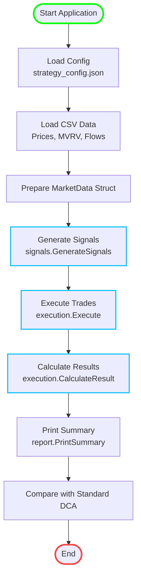
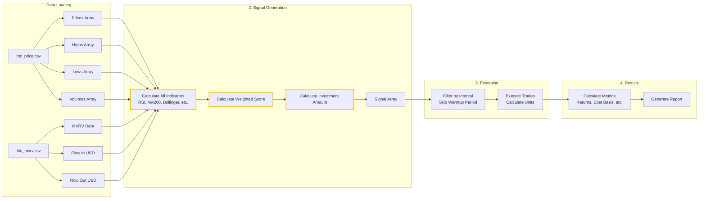
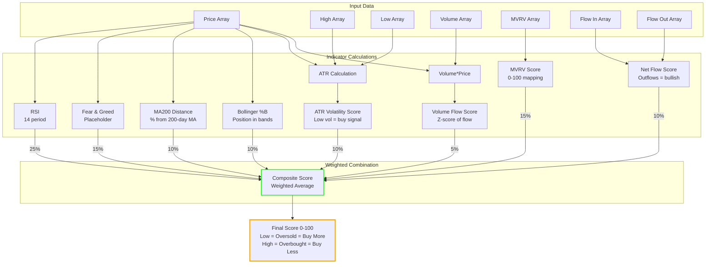
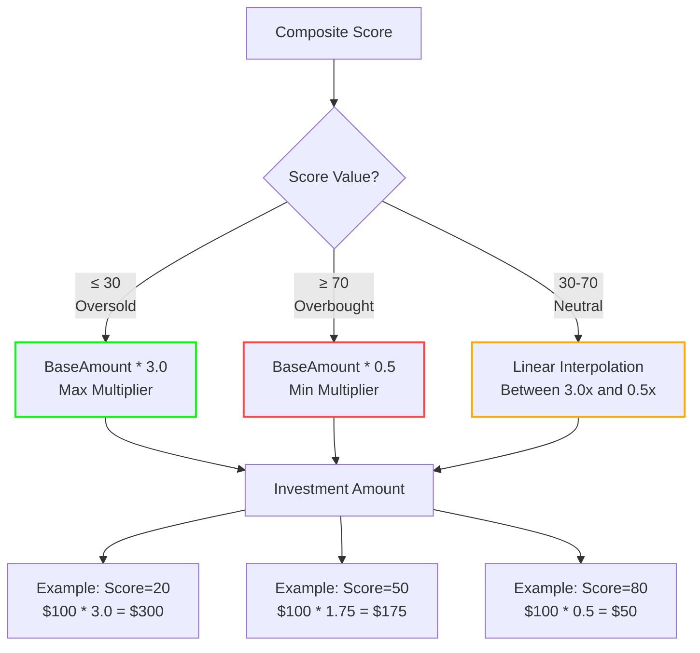
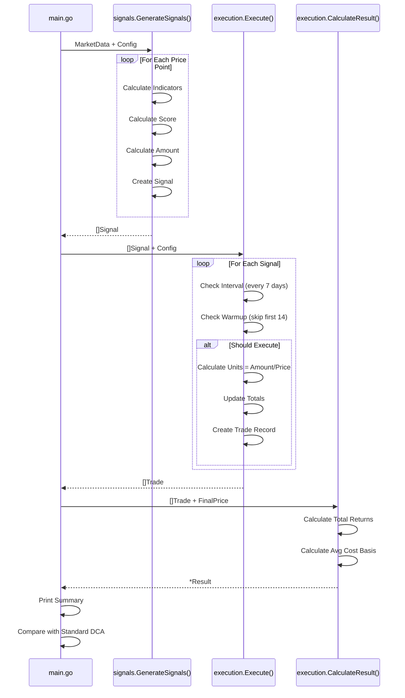
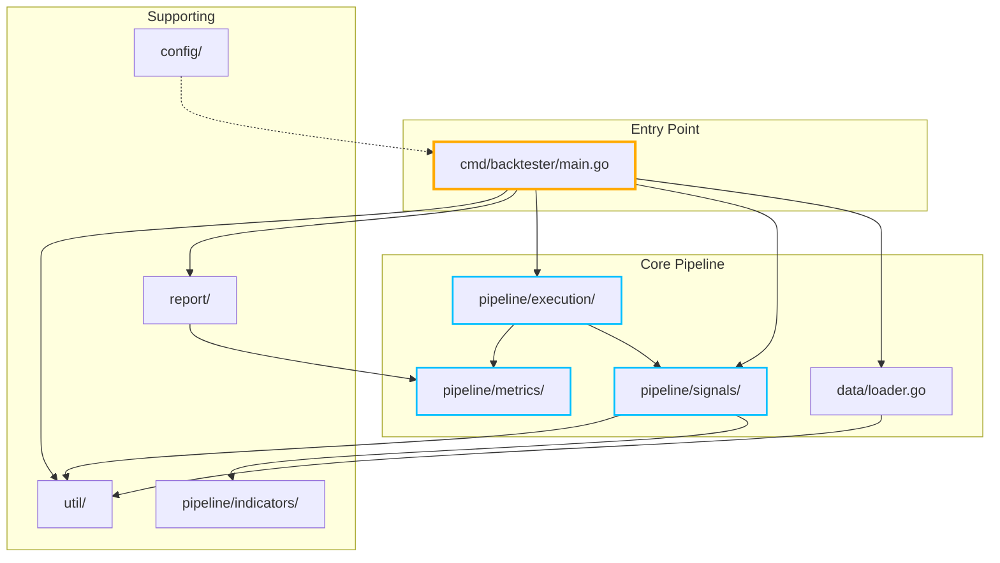
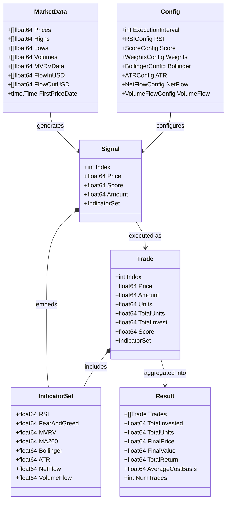
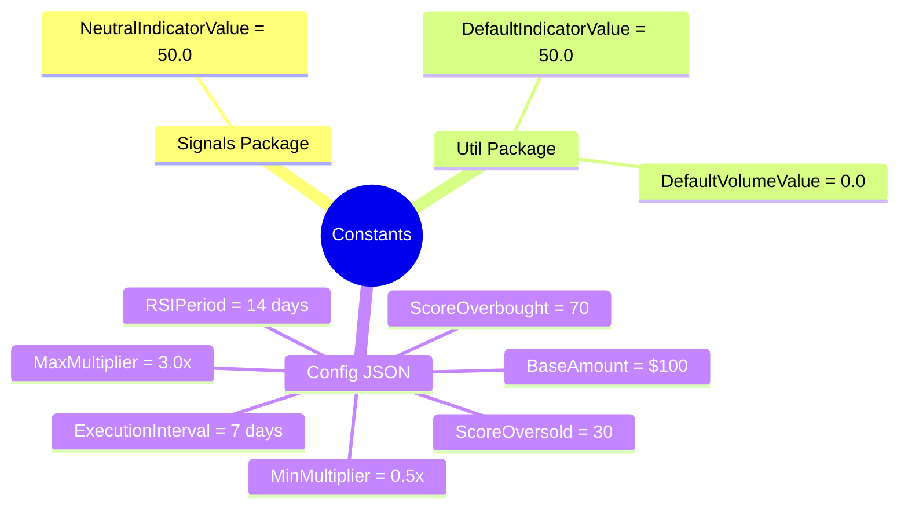
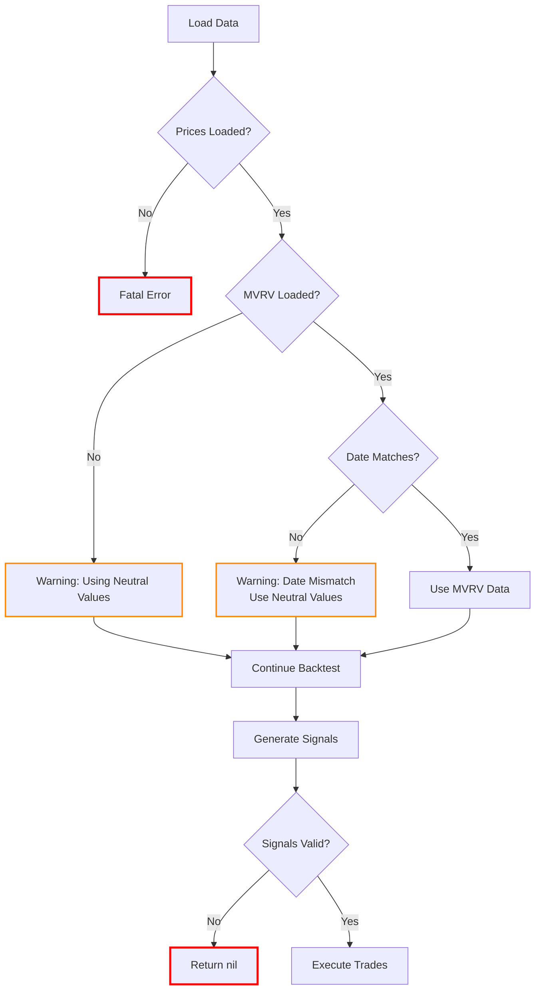

# Backtester Architecture & Flow

This document provides visual diagrams showing how the backtester works.

## High-Level System Flow

## Detailed Data Transformation Pipeline

## Indicator Calculation Flow

## Investment Amount Calculation

## Trade Execution Flow

## Package Dependencies

## Key Data Structures

## Execution Timeline Example

```mermaid
gantt
    title Trade Execution Timeline (Weekly DCA, 14-day warmup)
    dateFormat X
    axisFormat Day %d

    section Warmup
    Skip trades (warmup period)     :done, warmup, 0, 14

    section Trades
    Trade 1 (Day 14)                :crit, t1, 14, 1
    Skip (interval)                 :done, skip1, 15, 6
    Trade 2 (Day 21)                :crit, t2, 21, 1
    Skip (interval)                 :done, skip2, 22, 6
    Trade 3 (Day 28)                :crit, t3, 28, 1
    Skip (interval)                 :done, skip3, 29, 6
    Trade 4 (Day 35)                :crit, t4, 35, 1
```

## Constants & Configuration

## Error Handling & Validation

---

## Quick Reference

### Main Pipeline Functions

1. **`data.LoadPricesFromCSV()`** - Load price data from CSV
2. **`signals.GenerateSignals()`** - Calculate indicators and create signals
3. **`execution.Execute()`** - Execute trades based on signals
4. **`execution.CalculateResult()`** - Compute final metrics
5. **`report.PrintSummary()`** - Display results

### Key Configuration Parameters

- **ExecutionInterval**: Days between DCA purchases (default: 7)
- **RSIPeriod**: RSI calculation window (default: 14) - also sets warmup period
- **BaseAmount**: Base investment per interval (default: $100)
- **Weights**: Indicator importance (must sum to 100%)

### Indicator Score Meaning

- **0-30**: Oversold → Buy MORE (3.0x multiplier)
- **30-70**: Neutral → Linear scaling (3.0x → 0.5x)
- **70-100**: Overbought → Buy LESS (0.5x multiplier)
